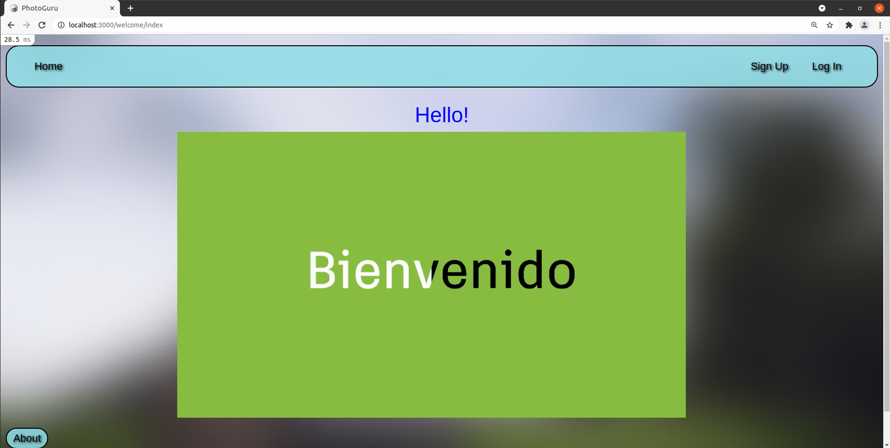
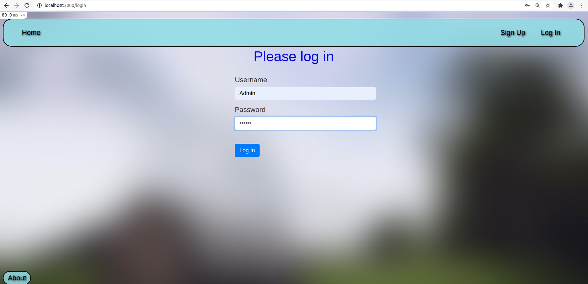

# Photo_App 

## Description

This project is about making a clone of Imgur called Photo_App. It allows users to upload images to their own User/Albums. The project was designed to have a medium difficulty for beginners learning to code with Ruby on Rails. It is a starting point for those who want to stand up a Rails application from scratch. Once you've explored this Rails application, feel free to update it and experiment on your own.

Link to github: https://github.com/wyncode/student-resources/tree/master/trio-project

## Screen Shots  
  
You will be greeted with a Welcome screen where you will find a link to the Sign Up form  


  

## Project collaborators 

Thank you to the Wyncode Cohorts who contributed to this project:

Link to github: https://github.com/asath1

Link to github: https://github.com/lopesmp 

## Installation

Steps necessary to get the application up and running.

Before you install Rails, you should check to make sure that your system has the proper prerequisites installed. These include:

* Ruby
* SQLite3
* Node.js
* Yarn

Run the follwing commands to confirm:

```bash
ruby --version
sqlite3 --version
node --version
yarn --version
```
Install Rails:
```bash
gem install rails
rails --version
```
Clone respository: 
```bash
git clone https://github.com/bchecchia/Photo_App.git
cd photo_app
```
Database creation:
```bash
rails db:create
rails db:migrate
```
Starting up the Web Server: 
```bash
rails server
```
To see the application in action, open a browser window and navigate to http://localhost:3000

## Usage 

Once the application is running you will be able to upload Users with a profile pic, username and password. Each user will then have the ability to create their own Albums to upload images files to. The application uses ActiveStorage to store blobs of the files uploaded which are then stored locally on your machine, but there is future potential for cloud uploads and many other options. 

## Project status

This project is still being develped and has the potential for more features and functionality.

## Roadmap

How would you like to see this project grow in the future? Please leave a comment and share any suggestions.
